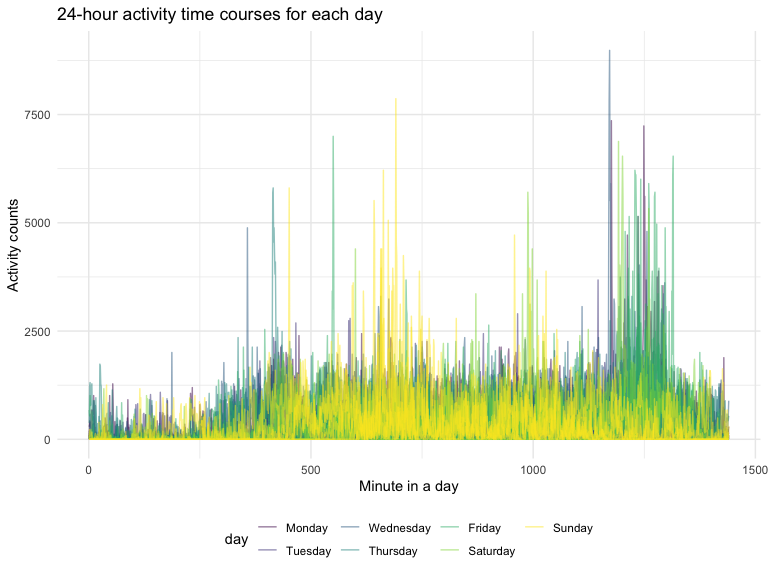

p8105_hw3_lg3239
================
Landi Guo
2022-10-16

## Problem 1

``` r
data("instacart")

instacart = 
  instacart %>% 
  as_tibble(instacart)
```

### Data Exploration

This dataset contains 1384617 rows and 15 columns, with each row
resprenting a single product from an instacart order. Variables include
identifiers for user, order, and product; the order in which each
product was added to the cart. There are several order-level variables,
describing the day and time of the order, and number of days since prior
order. Then there are several item-specific variables, describing the
product name (e.g. Yogurt, Avocado), department (e.g. dairy and eggs,
produce), and aisle (e.g. yogurt, fresh fruits), and whether the item
has been ordered by this user in the past. In total, there are 39123
products found in 131209 orders from 131209 distinct users.

There are 134 aisles, with fresh vegetables and fresh fruits holding the
most items.

``` r
instacart %>% 
  count(aisle) %>% 
  arrange(desc(n))
```

    ## # A tibble: 134 × 2
    ##    aisle                              n
    ##    <chr>                          <int>
    ##  1 fresh vegetables              150609
    ##  2 fresh fruits                  150473
    ##  3 packaged vegetables fruits     78493
    ##  4 yogurt                         55240
    ##  5 packaged cheese                41699
    ##  6 water seltzer sparkling water  36617
    ##  7 milk                           32644
    ##  8 chips pretzels                 31269
    ##  9 soy lactosefree                26240
    ## 10 bread                          23635
    ## # … with 124 more rows

This is a plot that shows the number of items ordered in each aisle,
which is ordered by ascending number of items.

``` r
instacart %>% 
  count(aisle) %>% 
  filter(n > 10000) %>% 
  mutate(aisle = fct_reorder(aisle, n)) %>% 
  ggplot(aes(x = aisle, y = n)) + 
  geom_point() + 
  labs(title = "Number of items ordered in each aisle") +
  theme(axis.text.x = element_text(angle = 60, hjust = 1))
```


This table shows the three most popular items in aisles
`baking ingredients`, `dog food care`, and `packaged vegetables fruits`,
including the number of times each item is ordered.

``` r
instacart %>% 
  filter(aisle %in% c("baking ingredients", "dog food care", "packaged vegetables fruits")) %>%
  group_by(aisle) %>% 
  #count the number of each product (n)
  count(product_name) %>% 
  #rank within each group according to n
  mutate(rank = min_rank(desc(n))) %>% 
  #three most popular items
  filter(rank < 4) %>% 
  arrange(desc(n)) %>%
  knitr::kable()
```

| aisle                      | product_name                                  |    n | rank |
|:---------------------------|:----------------------------------------------|-----:|-----:|
| packaged vegetables fruits | Organic Baby Spinach                          | 9784 |    1 |
| packaged vegetables fruits | Organic Raspberries                           | 5546 |    2 |
| packaged vegetables fruits | Organic Blueberries                           | 4966 |    3 |
| baking ingredients         | Light Brown Sugar                             |  499 |    1 |
| baking ingredients         | Pure Baking Soda                              |  387 |    2 |
| baking ingredients         | Cane Sugar                                    |  336 |    3 |
| dog food care              | Snack Sticks Chicken & Rice Recipe Dog Treats |   30 |    1 |
| dog food care              | Organix Chicken & Brown Rice Recipe           |   28 |    2 |
| dog food care              | Small Dog Biscuits                            |   26 |    3 |

This is a table showing the mean hour of the day at which Pink Lady
Apples and Coffee Ice Cream are ordered on each day of the week. Pink
Lady Apples are generally purchased slightly earlier in the day than
Coffee Ice Cream, with the exception of day 5.

``` r
instacart %>%
  filter(product_name %in% c("Pink Lady Apples", "Coffee Ice Cream")) %>%
  group_by(product_name, order_dow) %>%
  summarize(mean_hour = mean(order_hour_of_day)) %>%
  spread(key = order_dow, value = mean_hour) %>%
  knitr::kable(digits = 2)
```

    ## `summarise()` has grouped output by 'product_name'. You can override using the
    ## `.groups` argument.

| product_name     |     0 |     1 |     2 |     3 |     4 |     5 |     6 |
|:-----------------|------:|------:|------:|------:|------:|------:|------:|
| Coffee Ice Cream | 13.77 | 14.32 | 15.38 | 15.32 | 15.22 | 12.26 | 13.83 |
| Pink Lady Apples | 13.44 | 11.36 | 11.70 | 14.25 | 11.55 | 12.78 | 11.94 |

## Problem 2

### 1

The column names corresponding to each activity measurement are
transformed to one variable `minute`, representing each minute of a
24-hour day starting at midnight. The values are transformed to
`activity_measure`, representing the counts for each minute above. The
type of `minute` is in numeric. An additional variable
`weekday_vs_weekend` is added, specifying whether each measurement is on
weekday or on weekend.

``` r
acc_data = 
  read_csv("hw3_files/accel_data.csv") %>%
  janitor::clean_names() %>%
  pivot_longer(
    starts_with("activity"),
    names_to = "minute",
    names_prefix = "activity_",
    values_to = "activity_measure"
  ) %>%
  mutate(minute = as.integer(minute)) %>%
  mutate(weekday_vs_weekend = if_else(day %in% c("Saturday", "Sunday"), "weekend", "weekday"
  )) %>%
  mutate(day = factor(day, levels = c("Monday", "Tuesday", "Wednesday", "Thursday", "Friday", "Saturday", "Sunday")))
```

    ## Rows: 35 Columns: 1443
    ## ── Column specification ────────────────────────────────────────────────────────
    ## Delimiter: ","
    ## chr    (1): day
    ## dbl (1442): week, day_id, activity.1, activity.2, activity.3, activity.4, ac...
    ## 
    ## ℹ Use `spec()` to retrieve the full column specification for this data.
    ## ℹ Specify the column types or set `show_col_types = FALSE` to quiet this message.

This dataset contains 50400 rows and 6 columns, with each row
representing the observation of accelerometer data collected within one
minute time frame. Variables include number of the week, number of the
day, the day of the week, minute since midnight, accelerometer data, and
whether on weekday or weekend. These correspond to week, day_id, day,
minute, activity_measure, weekday_vs_weekend.

### 2

This table shows the total activity measurements for each day of the
week. This table is intentionally in untidied format for readers. The
maximum activity measurement are on the weekends for the first two
weeks. In contrast, the maximum activity measurements are on weekdays
for the following three weeks. The two lowest (abnormal) measurements
happens on Saturday on the last two weeks with the value of 1440. The
activity measurements are slightly higher on weekdays than on weekends.

``` r
acc_data %>%
  group_by(week, day) %>%
  summarise(total_activity = sum(activity_measure)) %>%
  pivot_wider(
    names_from = "week",
    values_from = "total_activity"
  ) %>%
  knitr::kable(digits = 2)
```

    ## `summarise()` has grouped output by 'week'. You can override using the
    ## `.groups` argument.

| day       |         1 |      2 |      3 |      4 |      5 |
|:----------|----------:|-------:|-------:|-------:|-------:|
| Monday    |  78828.07 | 295431 | 685910 | 409450 | 389080 |
| Tuesday   | 307094.24 | 423245 | 381507 | 319568 | 367824 |
| Wednesday | 340115.01 | 440962 | 468869 | 434460 | 445366 |
| Thursday  | 355923.64 | 474048 | 371230 | 340291 | 549658 |
| Friday    | 480542.62 | 568839 | 467420 | 154049 | 620860 |
| Saturday  | 376254.00 | 607175 | 382928 |   1440 |   1440 |
| Sunday    | 631105.00 | 422018 | 467052 | 260617 | 138421 |

### 3

This plot shows the 24-hour activity time courses for each day with
different colors indicating day of the week. There are some obvious
peaks for activity counts that are greater than 2500. The activity
counts show remarkable increase or peaks approximately when in the
morning around 8am, in the afternoon around 12pm, around 5pm, and in the
evening around 9 pm. Most of the data are below 2500.

``` r
acc_data %>%
  ggplot(aes(x = minute, y = activity_measure, group = interaction(week, day))) +
  geom_line(aes(color = day), alpha = .5) +
  labs(
    title = "24-hour activity time courses for each day",
    x = "Minute in a day",
    y = "Activity counts"
  ) 
```



## Problem 3

``` r
data("ny_noaa")
```

This dataset contains 2595176 rows and 7 columns, with each row
representing an observation on snow and weather conditions at certain
weather station. Variables include id, date, prcp, snow, snwd, tmax,
tmin, in which `prcp` is the precipitation in tenths of mm, `snow` is
snowfall(mm), `snwd` is snow depth(mm), and `tmax` `tmin` are
temperatures in tenths of degrees Celsius. The range of year is from
1981 to 2010.  
Each weather station may collect only a subset of these variables,
resulting in extensive missing values in variables except `id` and
`date`. Almost half of the `tmax` and `tmin` columns are missing, which
could become a problem when analyzing data on these variables. There is
no sufficient evidence that these missing values could be removed.  

### 1

For data cleaning, variables with units that are in tenths are converted
to standard scale by dividing by 10. `month` variable is converted into
month names, `day` and `year` are in numeric types.

``` r
ny_noaa_tidy = 
  ny_noaa %>%
  mutate(tmax = as.numeric(tmax)/10) %>%
  mutate(tmin = as.numeric(tmin)/10) %>%
  mutate(prcp = prcp/10) %>%
  separate(date, into = c("year", "month", "day"), sep = "-") %>%
  mutate(month = month.name[as.numeric(month)]) %>%
  mutate(day = as.numeric(day)) %>%
  mutate(year = as.numeric(year))
```

For snowfall, the most commonly observed value is `0` because there is
no snow in most of the days in a year. Below is the code used to get the
mode.

``` r
# Create the function for mode
getmode <- function(v) {
   uniqv <- unique(v)
   uniqv[which.max(tabulate(match(v, uniqv)))]
}

getmode(pull(ny_noaa_tidy, snow))
```

    ## [1] 0

### 2

This plot shows the the average max temperature in January and in July
in each station across years. Since there are too many weather stations,
the distinctions between each station is not shown in the plot, and many
of them overlap each other. The average max temperature in January
ranges around -10 to 10 °C, with one obvious outlier in the early 80’s.
The average max temperature in July ranges around 20 to 33 °C, with an
outlier below 15°C for a weather station in that specific year.

``` r
ny_noaa_tidy %>%
  group_by(id, year, month) %>%
  filter(month %in% c("January", "July")) %>%
  summarise(tmax_mean = mean(tmax, na.rm = TRUE)) %>%
  ggplot(aes(x = year, y = tmax_mean, group = id)) +
  geom_line(alpha = 0.5) +
  facet_grid(.~month) +
  labs(x = "Year",
       y = "Average maximum temperature (°C)",
       title = "Average max temperature in January and July for each station") +
  theme(axis.text.x = element_text(angle = 60, hjust = 1))
```

    ## `summarise()` has grouped output by 'id', 'year'. You can override using the
    ## `.groups` argument.


### 3

This combined plot contains two plots: max vs. min temperature for all
observations, and the distribution of snowfall values greater than 0 and
less than 100 for each year.

``` r
plot_i = 
  ny_noaa_tidy %>%
  ggplot(aes(x = tmin, y = tmax)) +
  geom_hex() +
  theme(legend.position = "right") +
  labs(x = "Minimum temperature (°C)",
       y = "Maximum temperature (°C)",
       title = "Max vs. min temperature for all observations") +
  theme(plot.title = element_text(size = 12))

plot_ii = 
  ny_noaa_tidy %>%
  filter(snow > 0 & snow < 100) %>%
  ggplot(aes(x = snow, y = year, group = year)) +
  geom_density_ridges(scale = 0.85) +
  labs(x = "Snowfall (mm)",
       y = "Year",
       title = "Distribution of snowfall (0 ~ 100mm) across years") +
  theme(plot.title = element_text(size = 12))
  
plot_i + plot_ii
```

    ## Picking joint bandwidth of 3.76


